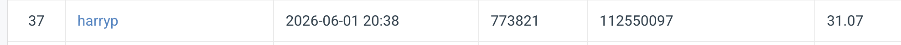

# NYCU Computer Vision 2026 HW4

- **Student ID:** 112550097
- **Name:** Hung-I Yang

---

## Introduction

This homework is an **image restoration** competition: remove **rain** and **snow** degradations from RGB images with a **single model**. Training pairs are provided (degraded ↔ clean); the test set uses numbered filenames (`0.png`–`99.png`) without revealing degradation type. The leaderboard metric is **PSNR** on restored outputs.

The implementation is **PromptIR** (train from scratch; no external data; no pretrained weights), implemented in **PyTorch** with **PyTorch Lightning** for training loops, checkpointing, and optional **Weights & Biases / TensorBoard** logging. `config.py` centralizes architecture flags (e.g. spatial prompts, decoder dropout, skip attention), training hyperparameters (patch-based training, augmentations, composite losses), and dataset paths. The report documents PromptIR, required modifications, and ablations in `Report/main.tex`.

---

## Project layout

Place the official dataset under the repository root so defaults in `config.py` resolve to `**./data`**. Typical layout:

```text
hw4/
├── pyproject.toml         # Project metadata, deps, uv / PyTorch index, optional extras
├── config.py              # Model / train / data paths
├── dataset.py             # Train, val, test PyTorch datasets
├── model.py               # PromptIR network
├── train.py               # Lightning training
├── inference.py           # Test inference → pred.npz (optional zip)
├── example_img2npz.py     # Helper example (if provided)
├── data/
│   ├── train/
│   │   ├── degraded/      # rain-*.png, snow-*.png
│   │   └── clean/         # rain_clean-*, snow_clean-*
│   └── test/
│       └── degraded/      # 0.png … 99.png
└── checkpoints/           # Created by train.py (per-run subfolders)
```

Paths are controlled by `DataConfig` in `config.py` (`train_degraded_dir`, `train_clean_dir`, `test_degraded_dir`). Override via CLI flags in `train.py` / `inference.py` where supported.

---

## Data layout

**Training / validation**


| Location               | Content                                                                         |
| ---------------------- | ------------------------------------------------------------------------------- |
| `data/train/degraded/` | Degraded images: `rain-1.png` … `rain-1600.png`, `snow-1.png` … `snow-1600.png` |
| `data/train/clean/`    | Matching clean images: `rain_clean-*.png`, `snow_clean-*.png`                   |


**Test**


| Location              | Content                                                         |
| --------------------- | --------------------------------------------------------------- |
| `data/test/degraded/` | `0.png` … `99.png` (degradation type not indicated by filename) |


---

## Environment setup

Python version follows `**pyproject.toml`** (`requires-python >= 3.10`). Dependencies (PyTorch, Lightning, TensorBoard, etc.) and optional groups are declared there; use **[uv](https://github.com/astral-sh/uv)** to sync the environment from the repo root:

```bash
# Core dependencies only (TensorBoard logging works out of the box)
uv sync
```

To also install **Weights & Biases** (matches `[project.optional-dependencies]` → `wandb` in `pyproject.toml`):

```bash
uv sync --extra wandb
```

`pyproject.toml` sets `**[tool.uv].extra-index-url**` to the PyTorch CUDA wheel index (`cu128`); adjust if your CUDA / platform differs. After syncing, run scripts with `uv run python train.py` (uses the project venv) or activate the `.venv` uv creates.

For W&B, run `wandb login` once. You can switch logger in `config.py` (`logger`: `"wandb"`, `"tensorboard"`, or `"none"`).

Optional dev tools (flake8, black, isort): `uv sync --extra dev` (combine extras: `uv sync --extra wandb --extra dev`).

---

## Usage

### Training

Defaults come from `get_config()` in `config.py` and can be overridden on the command line.

```bash
python train.py
```

For best result:
```bash
python train.py -loss_type l1_ssim --spatial_prompt --ema
```

Resume from a checkpoint:

```bash
python train.py --ckpt_path checkpoints/<run_id>/last.ckpt
```

### Inference (CodaBench submission)

Produces `**pred.npz**`: a NumPy archive whose keys are test filenames (e.g. `'0.png'`) and values are restored images with shape `**(3, H, W)**` (RGB, same spatial size as input; `uint8` is acceptable).

```bash
python inference.py --ckpt_path checkpoints/<run_id>/last.ckpt
```

Optional **test-time augmentation** and zip for upload:

```bash
python inference.py --ckpt_path checkpoints/<run_id>/last.ckpt --tta --zip
```

For best result:

```bash
python inference.py --ckpt_path checkpoints/<run_id>/last.ckpt \
    --spatial_prompt --ema
```

After generating `pred.npz`, place it inside the submission zip as required by CodaBench and **Add to Leaderboard** per course instructions.

---

## Performance snapshot


